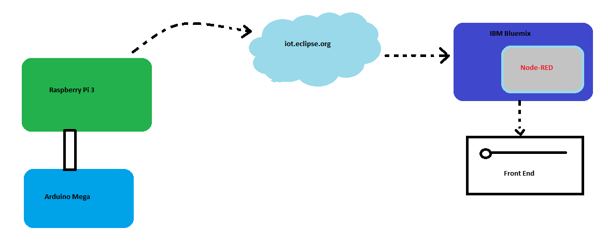
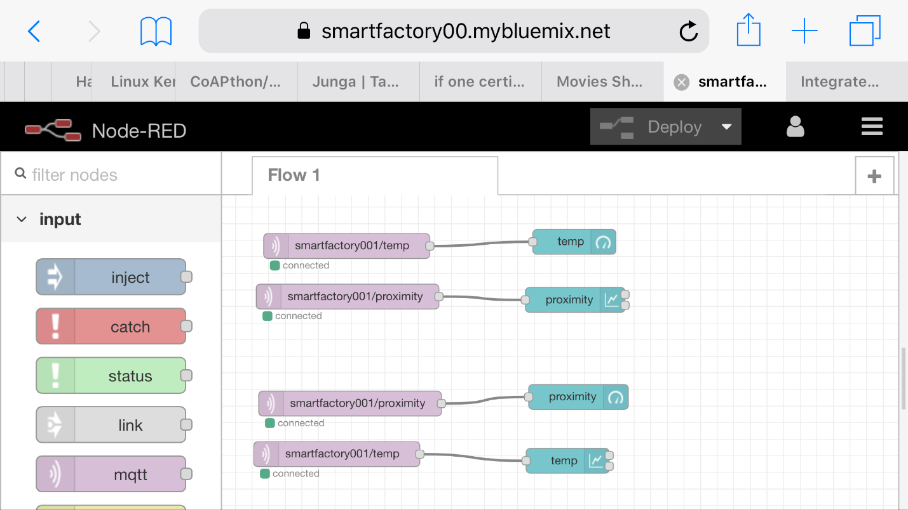
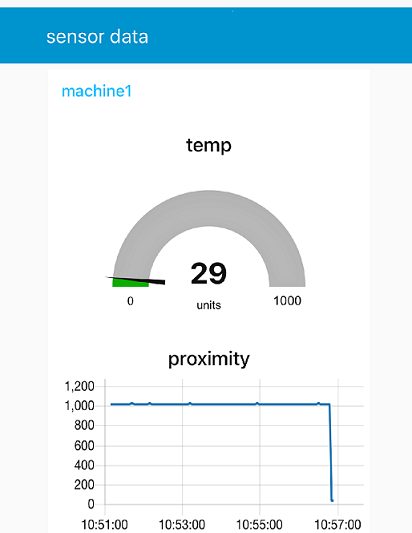
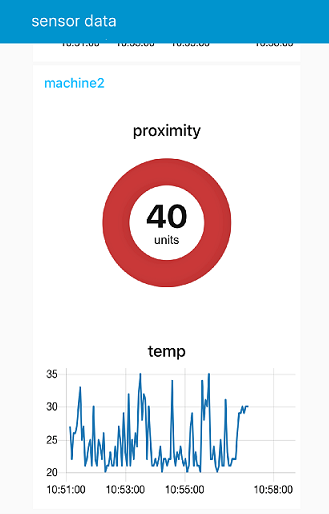
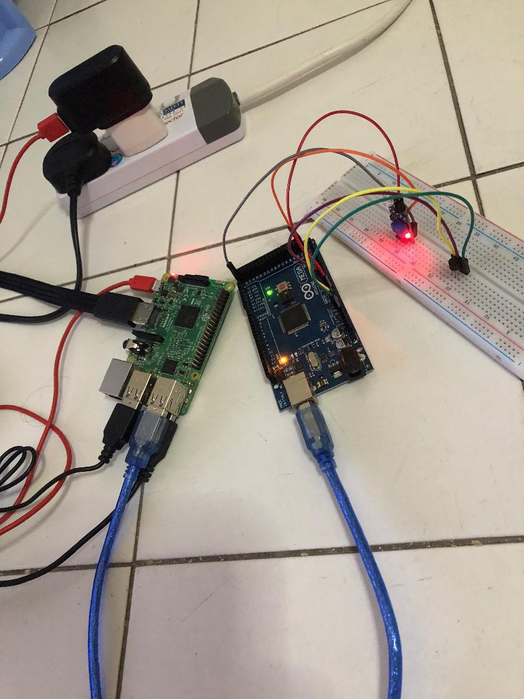

Build_FrontEnd_user_Visualize_data_Interface_Smartmachines_RaspberryPi_IBMCloud_Node-RED
========================================================================================

It is a concept of industrial IOT. Collect data from smart machines and build
the interface, where we can visualize the data and deploy that interface to the
client.

Here front-end app is created using Node-RED, and it is deployed in IBM cloud.
Arduino Mega is connected with sensors and from it, data is serially transmitted
to Raspberry Pi. Iot.eclipse.org act as a MQTT broker. Node-RED which is
deployed in IBM cloud subscribed to the topic, and the user interface is built.

Requirements:

-   Raspberry Pi3

-   Arduino Mega

-   Sensors: Temperature Sensor(LM 35), Proximity Sensor

-   PC, USB cable, Bread board and Jump wires

